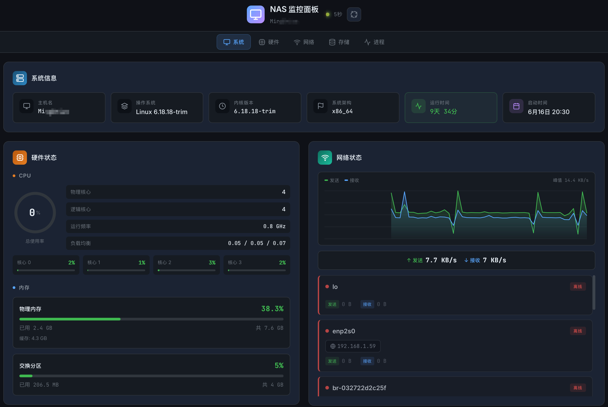
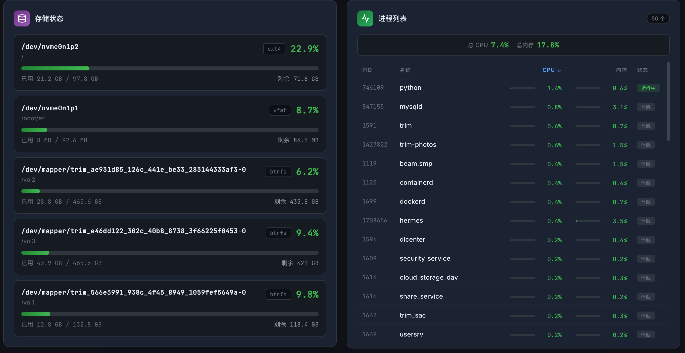

# NAS Monitor Panel

[English](README.en.md) | 中文

一个轻量级、现代化的 NAS 系统监控面板，提供实时系统状态、硬件监控、网络统计和进程管理功能。




## 功能特性

- **系统信息** - 操作系统版本、架构、运行时间、主机名
- **硬件监控** - CPU 使用率（整体/每核心）、内存使用、温度监控
- **网络监控** - 网络接口状态、IP 地址、实时上传/下载速度
- **存储监控** - 磁盘分区使用情况、读写统计
- **进程管理** - 进程列表、CPU/内存占用、网络连接状态
- **实时更新** - 可配置的自动刷新间隔（默认 5 秒）
- **响应式设计** - 完美适配桌面和移动设备
- **暗色主题** - 现代化的深色 UI 设计

## 技术栈

### 后端
- **Python 3.8+**
- **FastAPI** - 高性能异步 Web 框架
- **psutil** - 系统监控库
- **Uvicorn** - ASGI 服务器

### 前端
- **Vue 3** - 渐进式 JavaScript 框架
- **TypeScript** - 类型安全的 JavaScript 超集
- **Pinia** - Vue 状态管理
- **Vite** - 下一代前端构建工具

## 项目结构

```
nas-monitor-panel/
├── backend/                 # 后端代码
│   ├── config.py           # 配置管理
│   ├── main.py             # FastAPI 应用入口
│   ├── requirements.txt    # Python 依赖
│   ├── routers/            # API 路由
│   │   ├── system.py       # 系统信息
│   │   ├── hardware.py     # 硬件状态
│   │   ├── network.py      # 网络状态
│   │   ├── process.py      # 进程管理
│   │   └── storage.py      # 存储信息
│   └── services/           # 业务逻辑
│       └── collector.py    # 数据采集器
├── frontend/               # 前端代码
│   ├── src/
│   │   ├── App.vue         # 主应用组件
│   │   ├── components/     # Vue 组件
│   │   ├── stores/         # Pinia 状态管理
│   │   └── utils/          # 工具函数
│   ├── package.json        # Node.js 依赖
│   └── vite.config.ts      # Vite 配置
├── docs/                   # 文档
├── docker/                 # Docker 配置
├── config.example.yaml     # 配置示例
└── README.md               # 项目说明
```

## 快速开始

### 前置要求

- Python 3.8+
- Node.js 16+
- npm 或 yarn

### 安装步骤

#### 1. 克隆项目

```bash
git clone https://github.com/yourusername/nas-monitor-panel.git
cd nas-monitor-panel
```

#### 2. 配置项目

复制配置示例文件并修改：

```bash
cp config.example.yaml config.yaml
```

编辑 `config.yaml`，设置数据目录：

```yaml
host: 0.0.0.0
port: 8902
title: NAS Monitor Panel
refresh_interval: 5
data_dir: /path/to/your/data  # 修改为你的数据目录
ws_enabled: true
```

#### 3. 安装后端依赖

```bash
cd backend
pip install -r requirements.txt
```

#### 4. 安装前端依赖并构建

```bash
cd ../frontend
npm install
npm run build
```

#### 5. 启动服务

```bash
cd ../backend
python main.py
```

访问 http://localhost:8902 即可使用。

## API 接口

| 端点 | 方法 | 描述 |
|------|------|------|
| `/api/system/info` | GET | 获取系统信息 |
| `/api/system/uptime` | GET | 获取系统启动时间 |
| `/api/hardware/cpu` | GET | 获取 CPU 信息 |
| `/api/hardware/memory` | GET | 获取内存信息 |
| `/api/hardware/temperature` | GET | 获取温度信息 |
| `/api/network/interfaces` | GET | 获取网络接口 |
| `/api/network/io` | GET | 获取网络 IO 统计 |
| `/api/process/list` | GET | 获取进程列表 |
| `/api/process/connections` | GET | 获取网络连接 |
| `/api/storage/partitions` | GET | 获取磁盘分区 |
| `/api/storage/io` | GET | 获取存储 IO 统计 |

详细 API 文档请查看 [docs/api.md](docs/api.md)

## 部署指南

详细的部署说明请查看 [docs/deployment.md](docs/deployment.md)

### Docker 部署（推荐）

```bash
# 构建镜像
docker build -t nas-monitor-panel .

# 运行容器
docker run -d \
  --name nas-monitor \
  -p 8902:8902 \
  -v /path/to/data:/app/data \
  nas-monitor-panel
```

### Systemd 服务

```bash
# 创建服务文件
sudo nano /etc/systemd/system/nas-monitor.service
```

```ini
[Unit]
Description=NAS Monitor Panel
After=network.target

[Service]
Type=simple
User=your-user
WorkingDirectory=/path/to/nas-monitor-panel/backend
ExecStart=/usr/bin/python3 main.py
Restart=always
RestartSec=5

[Install]
WantedBy=multi-user.target
```

```bash
sudo systemctl enable nas-monitor
sudo systemctl start nas-monitor
```

## 配置说明

| 配置项 | 默认值 | 说明 |
|--------|--------|------|
| `host` | `0.0.0.0` | 监听地址 |
| `port` | `8902` | 监听端口 |
| `title` | `NAS Monitor Panel` | 面板标题 |
| `refresh_interval` | `5` | 刷新间隔（秒） |
| `data_dir` | - | 数据存储目录 |
| `ws_enabled` | `true` | 是否启用 WebSocket |

## 开发指南

### 本地开发

```bash
# 后端开发
cd backend
pip install -r requirements.txt
python main.py

# 前端开发（另一个终端）
cd frontend
npm install
npm run dev
```

前端开发服务器会在 http://localhost:5173 启动，并自动代理 API 请求到后端。

### 构建前端

```bash
cd frontend
npm run build
```

构建产物会输出到 `frontend/dist/` 目录。

## 常见问题

### Q: 温度监控显示 "不可用"？

A: 温度监控需要系统支持。在某些容器环境或虚拟机中可能不可用。

### Q: 如何修改端口？

A: 编辑 `config.yaml` 文件中的 `port` 配置项。

### Q: 如何设置开机自启？

A: 参考部署指南中的 Systemd 配置部分。

## 贡献指南

欢迎提交 Issue 和 Pull Request！

1. Fork 项目
2. 创建特性分支 (`git checkout -b feature/AmazingFeature`)
3. 提交更改 (`git commit -m 'Add some AmazingFeature'`)
4. 推送到分支 (`git push origin feature/AmazingFeature`)
5. 创建 Pull Request

## 许可证

MIT License - 详见 [LICENSE](LICENSE) 文件

## 致谢

- [FastAPI](https://fastapi.tiangolo.com/)
- [Vue.js](https://vuejs.org/)
- [psutil](https://github.com/giampaolo/psutil)
